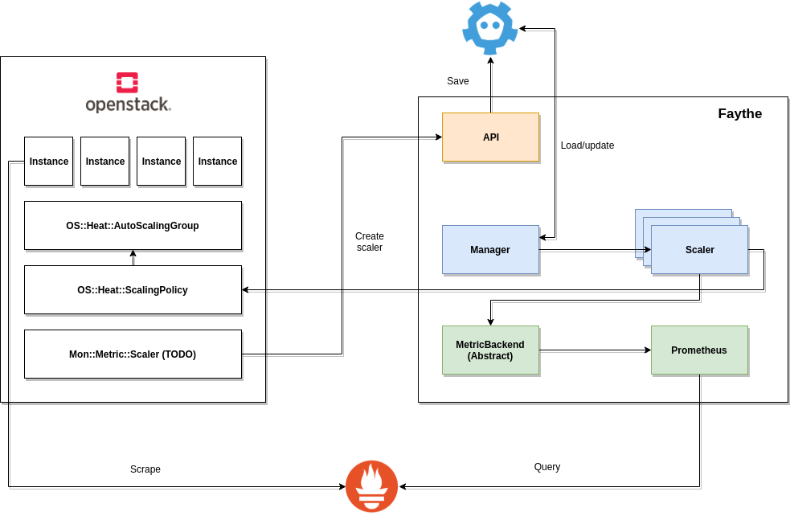
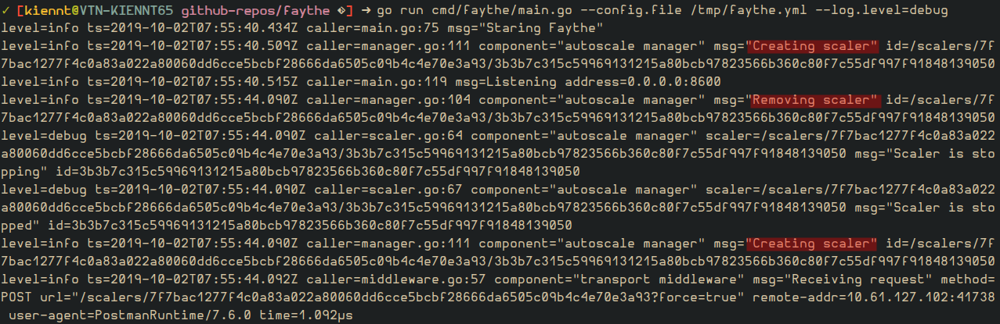
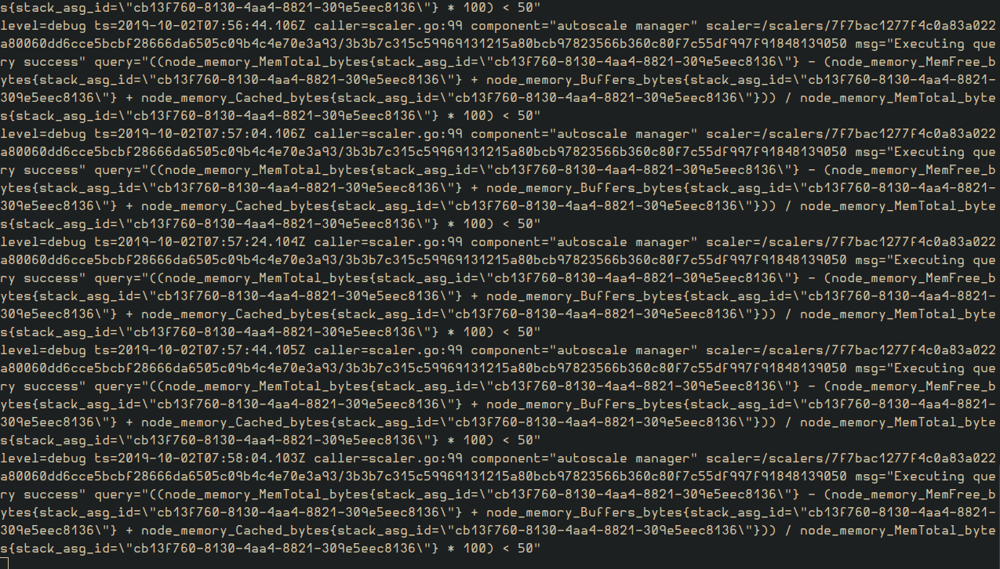

# OpenStack Autoscaling with Faythe guideline

- [OpenStack Autoscaling with Faythe guideline](#openstack-autoscaling-with-faythe-guideline)
  - [1. The standard OpenStack Autoscaling approach](#1-the-standard-openstack-autoscaling-approach)
    - [1.1. Main components](#11-main-components)
    - [1.2. Autoscaling process](#12-autoscaling-process)
    - [1.3. Drawbacks](#13-drawbacks)
  - [2. The approach with Faythe](#2-the-approach-with-faythe)
  - [3. The implementation](#3-the-implementation)
    - [3.1. The overall architecture](#31-the-overall-architecture)
    - [3.2. The workflow](#32-the-workflow)
  - [4. API](#4-api)
    - [4.1. Create a scaler](#41-create-a-scaler)
    - [4.2. List scalers](#42-list-scalers)

This guide describes how to automatically scale out/scale in your Compute instances in response to heavy system usage. By combining with Prometheus pre-defined rules that consider factors such as CPU or memory usage, you can configure OpenStack Orchestration (Heat) to add & remove additional instances automatically, when they are needed.

## 1. The standard OpenStack Autoscaling approach

Let's talk about the standard OpenStack Autoscaling approach before goes to the new approach.

### 1.1. Main components

- Orchestration: The core component providing automatic scaling is Orchestration (heat). Orchestration allows you to define rules using human-readable YAML templates. These rules are applied to evaluate system load based on Telemetry data to find out whether there is need to more instances into the stack. Once the load has dropped, Orchestration can automatically remove the unused instances again.

- Telemetry: Telemetry does performance monitoring of your OpenStack environment, collecting data on CPU, storage & memory utilization for instances & physical hosts. Orchestration templates examine Telemetry data to access whether any pre-defined action should start.
  - Ceilometer: a data collection service that provides the ability to normalise & transform data across all current OpenStack core components with work underway to support future OpenStack components.
  - Gnocchi: provides a time-series resource indexing, metric storage service with enables users to capture OpenStack resources & the metrics associated with them.
  - Aodh: enables the abiltity to trigger actions based on defined rules against sample or event data collected by Ceilometer.

### 1.2. Autoscaling process

For more details, you could check [IBM help documentation](https://ibm-blue-box-help.github.io/help-documentation/heat/autoscaling-with-heat/)

### 1.3. Drawbacks

- Ceilometer, Aodh are lacking of contribution. Ceilometer API was [deprecated](https://review.opendev.org/#/c/512286/). Either Transform & pipeline was [the same state](https://review.opendev.org/#/c/560854/), it means cpu_util will be unusable soon. In the commit message, @sileht - Ceilometer Core reviewer wrote that "Also backend like Gnocchi offers a better alternative to compute them". But Aodh still [deprecated Gnocchi aggregation API](https://github.com/openstack/aodh/blob/master/aodh/evaluator/gnocchi.py#L140) which doesn't support `rate:mean`. For more details, you can follow the [issue I've opened before](https://github.com/gnocchixyz/gnocchi/issues/999). Be honest, I was gave up on it - 3 projects which was tightly related together, one change might cause a sequence & break the whole stack, how can I handle that?
- Aodh has its own formula to define rule based on Ceilometer metrics (that were stored in Gnocchi). But it isn't correct sometimes cause the wrong scaling action.
- In reality, I face the case that Rabbitmq was under heavy load due to Ceilometer workload.
- IMO, Gnocchi documentation is not good enough. It might be a bias personal opinion.

## 2. The approach with Faythe

Actually, this isn't a complete new approach, it still leverages Orchestration (heat) to do scaling action. The different comes from Monitor service.

Take a look at [Rico Lin - Heat's PTL, autoscale slide](https://www.slideshare.net/GuanYuLin1/autoscale-a-selfhealing-cluster-in-openstack-with-heat), basically, Autoscaling is the combination of 3 steps:

- Metering.
- Alarm.
- Scale.


OpenStack Telemetry takes care of `Metering` & `Alarm`. Ok, the new approach is simply using _others that can take Telemetry roles_.

```
Gnocchi + Aodh + Ceilometer --> Faythe + Prometheus
```

**Why Prometheus?**

- Nice query language: Prometheus provides a functional query language called PromQL (Prometheus Query Language) that lets the user select & aggregate time series data in real time.
- A wide range of exporter: The more exporter the more metrics I can collect & evaluate.
- Flexibile: Beside the system factor like CPU/Memory usage, I can evaluate any metrics I can collect, for example: JVM metrics.
- Others? _Take time to investigate about Prometheus and fill it here by yourself_

**Why Faythe?**

- The one who stays in the middle to connect OpenStack services with external like Prometheus.
- Our goal is able to trigger an autoscale event after evaluate instance's metrics. Prometheus can collect & evaluate metrics to fire an alarm, it's done the job. How can we trigger the event when an alarm is fired? I used to use Prometheus Alertmanager to send request to webhook. There are 2 types of webook:
  - **Fixed webhook** - OS::Heat::ScalingPolicy alarm url. It's fixed & can be only used for just 1 stack.
  - **Dynamic webhook** - Faythe previous version, gets the alerts from request's body then processes to find scale url. But it heavily depends on `labels`. Imagine that we have an OOM instance, Prometheus Alertmanager sends a POST request to the pre-defined url. We have to find an AutoscalingGroup & ScalingPolicy manages this instance. To do it, we need an extra information from request body. Other fields are fixed (`instance`, `started_at`,... - [the structure](https://prometheus.io/docs/alerting/notifications/#alert)), `labels` is the only field we can extract information. We have to change either Prometheus configuration, Prometheus server alert rules, Alertmanager configuration & Heat template. Not all stacks share the same alert rules. Some might be fired when memory is over than 85%, but others can survive even memory is 90%. Therefore, we have to set rule for each stack, reload/restart Prometheus server then. Beside that even we have enough `labels`, it's still hard to find a stack, especially `nested stack resource`. The work becomes a nightmare!

## 3. The implementation

### 3.1. The overall architecture



### 3.2. The workflow

> NOTE: When send a request to Faythe, you might need to authenticate with JWT.

- Create Heat stack with AutoscalingGroup & ScalingPolicy.
- Register your cloud with Faythe - a POST request with the following body. If you already register the cloud, skip this step

```json
POST /clouds/openstack
Req
{
  "auth": {
    "username": "superuser",
    "auth_url": "http://10.240.201.100:5000", // Require
    "password": "secretpassword",
    "project_name": "autoscaling-test"
  },
  "monitor": {
    "backend": "prometheus", // Require
    "address": "http://10.240.201.233:9091" // Require
  },
  "provider": "openstack",
  "tags": [
    "vsmart",
    "test"
  ]
}
```

- Verify.

```json
GET /clouds/
Resp
{
    "Status": "OK",
    "Data": {
        "/clouds/eb31219d766fde6d8f2d8bcad6269175": {
            "provider": "openstack",
            "id": "eb31219d766fde6d8f2d8bcad6269175",
            "endpoints": null,
            "monitor": {
                "backend": "prometheus",
                "address": "http://10.240.201.233:9091",
                "metadata": null
            },
            "auth": {
                "auth_url": "http://10.240.201.100:5000",
                "region_name": "",
                "username": "superuser",
                "userid": "",
                "password": "secretpassword",
                "domain_name": "",
                "domain_id": "",
                "project_name": "autoscaling-test",
                "project_id": ""
            },
            "tags": [
              "vsmart",
              "test"
            ]
        }
    },
    "Err": ""
}
```

- Create a scaler to watch & handle Stack scale, `eb31219d766fde6d8f2d8bcad6269175` is the cloud provider id which is created by hash its auth-url. Not that, there is a sample query, you can put any Prometheus query there.

```json
POST /scalers/eb31219d766fde6d8f2d8bcad6269175/dfd8327e456413db7b3b493ef262cf20
Req
{
	"query": "avg by(stack_asg_id) ((node_memory_MemTotal_bytes{stack_asg_id=\"cb13f760-8130-4aa4-8821-309e5eec8136\"} - (node_memory_MemFree_bytes{stack_asg_id=\"cb13f760-8130-4aa4-8821-309e5eec8136\"} + node_memory_Buffers_bytes{stack_asg_id=\"cb13f760-8130-4aa4-8821-309e5eec8136\"} + node_memory_Cached_bytes{stack_asg_id=\"cb13f760-8130-4aa4-8821-309e5eec8136\"})) / node_memory_MemTotal_bytes{stack_asg_id=\"cb13f760-8130-4aa4-8821-309e5eec8136\"} * 100) < 20",
	"duration": "5m",
	"interval": "30s",
	"actions": {
		"scale_in": {
			"url": "http://10.240.201.100:8000/v1/signal/arn%3Aopenstack%3Aheat%3A%3Ad897ac7ef31143fd85a0474d9010290d%3Astacks/test-autoscale-new-test-service-asg-a67s7kftanzq/cb13f760-8130-4aa4-8821-309e5eec8136/resources/scalein_policy?Timestamp=2019-09-30T02%3A50%3A35Z&SignatureMethod=HmacSHA256&AWSAccessKeyId=c9dfe2470b45476ebd63153d8b2f1c6c&SignatureVersion=2&Signature=Lb4yROkvWDBkRTSQdI222slzzkrCtmZHbgn67Siw7Dw%3D",
			"attempts": 4,
			"delay": "50ms",
			"type": "http",
			"delay_type": "backoff",
			"method": "POST"
		}
	},
	"cooldown": "400s",
	"tags": [
        "test-project",
        "autoscaling"
    ],
	"active": true
}
```

- The user should aware of the query language (PromQL is the only one at this time).

- In order for the query to target the hosts that are part of the OpenStack AutoscalingGroup, the `query` configuration parameter should contain an unique set of labels (for example: `stack_asg_id`, `stack_asg_name`...).

* A scaler is created. If a scaler with the same id was existed, just recreate it, Manager has a registry to manage scaler lifecycle. Faythe leverages [Etcd watch for changes mechanism](https://www.oreilly.com/library/view/coreos-essentials/9781785283949/ch02s04.html) to update the registry. The rule is quite simple.

```
- PUT + Create: start scaler.
- PUT + Modify: stop, remove scaler then start scaler.
- DELETE: stop & remove scaler.
```



- A scaler evaluates a query every 30 seconds (The `interval`).



- If any metrics are out of range, the Alert won't be fired immediately. After 5 minutes (the `duration`), the alert is still active, fire it! Now the defined actions will be executed. Next cycle, Faythe will disable scaling events untils cooldown period is over.

## 4. API

### 4.1. Create a scaler

**PATH**: `/scalers/{provider-id}`

**METHOD**: `POST`

| Parameter          | In   | Type    | Required | Default | Description                                                                                                                                                                                      |
| ------------------ | ---- | ------- | -------- | :------ | ------------------------------------------------------------------------------------------------------------------------------------------------------------------------------------------------ |
| id                 | path | string  | true     |         | The cloud provider id.                                                                                                                                                                           |
| query              | body | string  | true     |         | Query that will be executed against the Prometheus API. See [the official documentation](https://prometheus.io/docs/prometheus/latest/querying/basics/) for more details.                        |
| duration           | body | string  | true     |         | The time that the `AutoscalingPolicy` must alert the threshold before the policy triggers a scale up or scale down action                                                                        |
| interval           | body | string  | true     |         | The time between two continuous evaluate, re.the format please refer [note](./note.md#time-durations).                                                                                           |
| actions            | body | object  | true     |         | The defined scale actions.                                                                                                                                                                       |
| actions.url        | body | string  | true     |         | The                                                                                                                                                                                              |
| actions.type       | body | string  | false    | http    | The type of action.                                                                                                                                                                              |
| actions.method     | body | string  | false    | POST    | The HTTP method                                                                                                                                                                                  |
| actions.attempts   | body | integer | false    | 10      | The count of retry.                                                                                                                                                                              |
| actions.delay      | body | string  | false    | 100ms   | The delay between retries. Please refer [note](./note.md#time-durations) for formats.                                                                                                         |
| actions.delay_type | body | string  | false    | fixed   | The delay type: `fixed` or `backoff`. BackOffDelay is a DelayType which increases delay between consecutive retries. FixedDelay is a DelayType which keeps delay the same through all iterations |
| description        | body | string  | false    |         |                                                                                                                                                                                                  |
| metadata           | body | string  | false    |         |                                                                                                                                                                                                  |
| active             | body | boolean | true     | false   | Enable the scaler or not.                                                                                                                                                                        |
| cooldown           | body | string  | false    | 10m     | The period to disable scaling events after a scaling action takes place, re.the format please refer [note](./note.md#time-durations).                                                            |
|                    |      |         |          |         |                                                                                                                                                                                                  |

### 4.2. List scalers

**PATH**: `/scalers/{provider-id}`

**METHOD**: `GET`

| Parameter | In    | Type   | Required | Default | Description                                                                                             |
| --------- | ----- | ------ | -------- | :------ | ------------------------------------------------------------------------------------------------------- |
| id        | path  | string | true     |         | The cloud provider id.                                                                                  |
| tags      | query | string | false    |         | A list of tags to filter the scaler list by. Scalers that match all tags in this list will be returned. |
| tags-any  | query | string | false    |         | A list of tags to filter the scaler list by. Scalers that match any tags in this list will be returned. |
|           |       |        |          |         |                                                                                                         |
