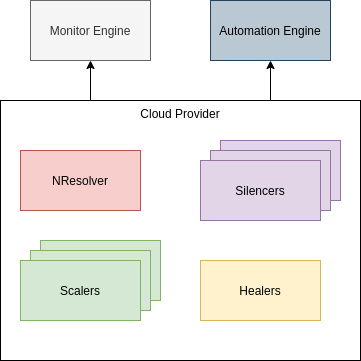

# Getting started

- [Getting started](#getting-started)
  - [1. First run](#1-first-run)
    - [1.1. Setup Etcd cluster](#11-setup-etcd-cluster)
    - [1.2. Use executable file](#12-use-executable-file)
    - [1.3. Use Docker image](#13-use-docker-image)
    - [1.4. Use docker-compose](#14-use-docker-compose)
  - [2. Flag](#2-flag)
  - [3. Configuration](#3-configuration)
    - [3.1. Global configuration](#31-global-configuration)
    - [3.2. Etcd configuration](#32-etcd-configuration)
    - [3.3. JWT configuration](#33-jwt-configuration)
  - [4. Terms](#4-terms)
    - [4.1. Cloud provider](#41-cloud-provider)
    - [4.2. Scaler](#42-scaler)
    - [4.3. Healer](#43-healer)
    - [4.4. NResolver (Name resolver)](#44-nresolver-name-resolver)
    - [4.5. Silencers](#45-silencers)
    - [4.6. Monitor Engine](#46-monitor-engine)
    - [4.7. Cluster members](#47-cluster-members)
    - [4.8. Cluster members](#48-cluster-members)
  - [5. Get token](#5-get-token)
  - [6. Cloud APIs](#6-cloud-apis)
    - [6.1. Register Cloud provider](#61-register-cloud-provider)
    - [6.2. List all clouds](#62-list-all-clouds)
    - [6.3. Delete the cloud](#63-delete-the-cloud)

## 1. First run

### 1.1. Setup Etcd cluster

- Deploy [Etcd cluster](https://github.com/etcd-io/etcd) if you haven't already had one. This is the heart of Faythe. Please note that:

  - An etcd cluster needs a majority of nodes, a quorum, to agree on updates to the cluster state. For a cluster with n members, quorum is (n/2)+1.
  - A 5-member etcd cluster can tolerate two member failures, which is enough in most cases.
  - Check [Etcd FAQ](https://github.com/etcd-io/etcd/blob/master/Documentation/faq.md) for more details.

- Check out the [setup & operate Etcd cluster guideline](https://ntk148v.github.io/blog/posts/operate-etcd-cluster/).

- In the [sample docker-compose file](../docker-compose.yml), the Etcd authentication is disabled. For production ready setup, operator should [enable & setup authentication](https://github.com/etcd-io/etcd/blob/master/Documentation/op-guide/authentication.md). The Faythe user must have role to access to a range of keys with prefix which is the value of `--cluster-id` [flag](#2-flag).

- Example:

  - Create a `faytheuser` user:

  ```bash
  # Enable authentication first
  # https://github.com/etcd-io/etcd/blob/master/Documentation/op-guide/authentication.md#enabling-authentication
  # etcdctl user add root
  # etcdctl --user root:rootpw auth enable
  $ etcdctl user add faytheuser
  ```

  - Create a role & grant access to Faythe cluster id (for example: `production`):

  ```bash
  $ etcdctl role add faytherole
  $ etcdctl role grant-permission faytherole --prefix readwrite production/
  ```

  - Grant role:

  ```bash
  $ etcdctl user grant-role faytheuser faytherole
  ```

  - Run faythe with flag `--cluster-id`:

  ```bash
  /faythe/binary/file --cluster-id=production
  ```

### 1.2. Use executable file

- Clone the repository & cd into it:

```bash
$ git clone github.com/vCloud-DFTBA/faythe
$ cd faythe
```

- Build & run:

```bash
# Build it
$ go build -mod vendor -o /path/to/executable/faythe cmd/faythe/main.go
# Create a config file / Simply make a clone
$ cp examples/faythe.yml /path/to/config/dir/config.yml
# Modify /path/to/config/dir/config.yml
# Run it
$ /path/to/executable/faythe --config.file /path/to/config/dir/config.yml
```

### 1.3. Use Docker image

- Build Docker image (use git tag/git branch as Docker image tag).

```bash
$ make build
```

- Run container from built image.

```bash
$ make run
```

- For more details & options please check [Makefile](../Makefile).

### 1.4. Use docker-compose

- Update [sample config file](../examples/faythe.yml).

- Run docker-compose, it will build faythe image, start faythe & etcd container.

```bash
$ docker-compose up -d
```

## 2. Flag

```bash
usage: main [<flags>]

The Faythe server

Flags:
  -h, --help                   Show context-sensitive help (also try --help-long and --help-man).
      --config.file="/etc/faythe/config.yml"
                               Faythe configuration file path.
      --listen-address="0.0.0.0:8600"
                               Address to listen on for API.
      --external-url=<URL>     The URL under which Faythe is externally reachable.
      --cluster-id=CLUSTER-ID  The unique ID of the cluster, leave it empty to initialize a new cluster. This will be the root prefix for all Faythe keys stored in
                               Etcd.
      --log.level=info         Only log messages with the given severity or above. One of: [debug, info, warn, error]
      --log.format=logfmt      Output format of log messages. One of: [logfmt, json]
```

## 3. Configuration

For more information, please check [config/module](../config).

```yaml
enable_profiling: true
admin_authentication:
  username: admin
  password: secret
mail:
  host: "emailhost"
  protocol: "smtp"
  port: 9011
  username: "faythe"
  password: "faythepassword"
# Etcd configuration
etcd:
  endpoints: ["etcdhost:2379"]
  username: root
  password: test
jwt:
  private_key_location: /warehouse/data/faythe-config/keys/faythe.rsa
  public_key_location: /warehouse/data/faythe-config/keys/faythe.rsa.pub
  signing_method: RS256
  is_bearer_token: true
```

### 3.1. Global configuration

- `remote_host_pattern`: define an optional regexp host pattern to be matched. Faythe accepts requests from every hosts by default, no restrict. Please check Golang regex cheatsheet for more details.

  ```yaml
  # Example
  # Allow requests from every hosts.
  remote_host_pattern: ".*"
  # Allow requests from host whose ip address starts with 192.168.128 or 192.168.129
  remote_host_pattern: "192.168.(128|129).*"
  ```

- `basic_auth`: HTTP basic authentication with `username` & `password`. If you don't want to enable basic authentication, just remove this section.

### 3.2. Etcd configuration

Etcd is a Faythe's heart. You can figure out etcd configuration [here](https://github.com/etcd-io/etcd/blob/master/clientv3/config.go). The configuration in Faythe is just a mimic.

### 3.3. JWT configuration

Faythe uses JWT for authentication & authorization. The configuration in Faythe is a clone of [the JWT Options](https://github.com/adam-hanna/jwt-auth/blob/develop/jwt/auth.go#L31).

## 4. Terms

There are the illustration about the Faythe objects:



Every Faythe objects is stored in Etcd.

> **NOTE**: Every Faythe objects will stay under the cluster namespace which is defined by the flag `--cluster-id`.

### 4.1. Cloud provider

- Etcd path, the cloud provider id which is created by hash its auth-url.

```
/<cluster-id>/clouds/<provider-id>
```

- The main object, represents Cloud information: type, auth url, credentials, its monitor engine...

- It contains the rest of objects (scalers, healers...) logically.

- The only supported provider type at this time is [OpenStack](https://openstack.org/).

### 4.2. Scaler

- Etcd path:

```
/<cluster-id>/scalers/<provider-id>/<scaler-id>
```

- `Scaler` has a user-defined query which can be evaluated based on Monitor engine metrics then execute the defined actions (HTTP Action to scale up/scale down). The query must be follow the Monitor Engine query format.

- One `Cloud provider` can have **many** `Scaler`.

### 4.3. Healer

- Etcd path:

```
/<cluster-id>/healers/<provider-id>/<healer-id>
```

- `Healer` receives the query from user & evaluate the need of healing for hosts based on that query. The query must be follow the Monitor Engine query format.

- One `Cloud provider` has **only one** `Healer`.

### 4.4. NResolver (Name resolver)

- Etcd path:

```
/<cluster-id>/nresolvers/<provider-id>/<nresolver-id>
```

- Name resolver as the name it tells, it resolve host IP address to host's name.

- Some cloud providers, OpenStack for example, execute commands based on host's name not the IP address. On the other hand, some metrics backends only care about host IP address. Hence, Faythe needs to store the mapping of host IP address & its name.

- One `Cloud provider` has **only one** `NResolver`.

### 4.5. Silencers

- Etcd path:

```
/<cluster-id>/silencers/<cloud-id>/<silencer-id>
```

- Silencers come in handy if you want to add a set of ignored hosts in case of maintenance. It controls the healer.

- One `Cloud provider` can have **many** `Silencers`.

### 4.6. Monitor Engine

- A `Cloud provider` always associate with a `Monitor Engine`.

- A `Monitor Engine` represents the monitor information: backend type ([Prometheus](https://prometheus.io) is the only supported backend at this time), url address, credentials,...

- Other objects like scaler, healer... integrate with `Monitor Engine` to evaluate.

### 4.7. Cluster members

- Etcd path:

```
/<cluster-id>/cluster/<member-id>
```

- Cluster member stores a Cluster member information (hostname, id, ip address).

### 4.8. Cluster members

- Etcd path:

```
/<cluster-id>/cluster/<member-id>
```

- Cluster member stores a Cluster member information (hostname, id, ip address).

## 5. Get token

Before do other magic things, you have to login first. Faythe uses [JSON Web Token](https://jwt.io/). By passing the username & password, users receive a token be stored in header. Set the header with the retrieved response header to every next requests sent to the Faythe.

To receive an Faythe with appropriate policies, please contact the admin. Check the [authentication-authorization docs](./authn-authz.md) for details.

## 6. Cloud APIs

The Cloud provider is the main object so you have to register one first. Check out the following APIs.

### 6.1. Register Cloud provider

**PATH**: `/clouds/{provider}`

**METHOD**: `POST`

| Parameter             | In   | Type   | Required | Default | Description                                                                                           |
| --------------------- | ---- | ------ | -------- | ------- | ----------------------------------------------------------------------------------------------------- |
| provider              | path | string | true     |         | The cloud provider type. OpenStack is the only provider supported by now.                             |
| provider              | body | string | true     |         | The cloud provider type. OpenStack is the only provider supported by now.                             |
| endpoints             | body | dict   | false    |         | The map of Cloud provider endpoints.                                                                  |
| monitor               | body | object | true     |         | The Cloud monitor.                                                                                    |
| monitor.backend       | body | string | true     |         | The name of monitor service. Prometheus is the only supported by now.                                 |
| monitor.address       | body | string | true     |         | The monitor service's endpoint used to query metrics. Should be in the format: `scheme://host:<port>` |
| monitor.username      | body | string | false    |         | The monitor service username (basic auth)                                                             |
| monitor.password      | body | string | false    |         | The monitor service password (basic auth)                                                             |
| auth (openstack only) | body | object | true     |         | Auth stores information needed to authenticate to an OpenStack Cloud.                                 |
| auth.auth_url         | body | string | true     |         | The HTTP endpoint that is required to work with the Identity API of the appropriate version.          |
| auth.region_name      | body | string | false    |         | The OpenStack region.                                                                                 |
| auth.username         | body | string | false    |         | The OpenStack Keystone username.                                                                      |
| auth.password         | body | string | false    |         | The OpenStack Keystone username's password.                                                           |
| auth.domain_name      | body | string | false    |         | The OpenStack Keystone domain name.                                                                   |
| auth.domain_id        | body | string | false    |         | The OpenStack Keystone domain id.                                                                     |
| auth.project_name     | body | string | false    |         | The OpenStack Keystone project name.                                                                  |
| auth.project_id       | body | string | false    |         | The OpenStack Keystone domain id.                                                                     |

### 6.2. List all clouds

**PATH**: `/clouds`

**METHOD**: `GET`

| Parameter | In    | Type   | Required | Default | Description                                                                                           |
| --------- | ----- | ------ | -------- | :------ | ----------------------------------------------------------------------------------------------------- |
| provider  | query | string | false    |         | Filter cloud list result by provider.                                                                 |
| id        | query | string | false    |         | Filter cloud list result by id.                                                                       |
| tags      | query | string | false    |         | A list of tags to filter the cloud list by. Clouds that match all tags in this list will be returned. |
| tags-any  | query | string | false    |         | A list of tags to filter the cloud list by. Clouds that match any tags in this list will be returned. |
|           |       |        |          |         |                                                                                                       |

### 6.3. Delete the cloud

**PATH**: `/clouds/{provider-id}`

**METHOD**: `DELETE`

| Parameter | In   | Type   | Required | Default | Description            |
| --------- | ---- | ------ | -------- | :------ | ---------------------- |
| id        | path | string | true     |         | The cloud provider id. |
